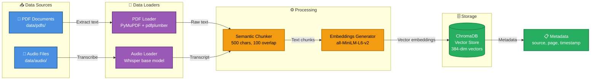
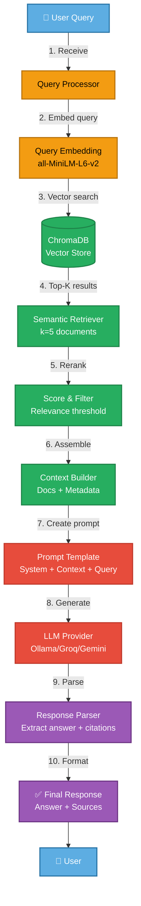
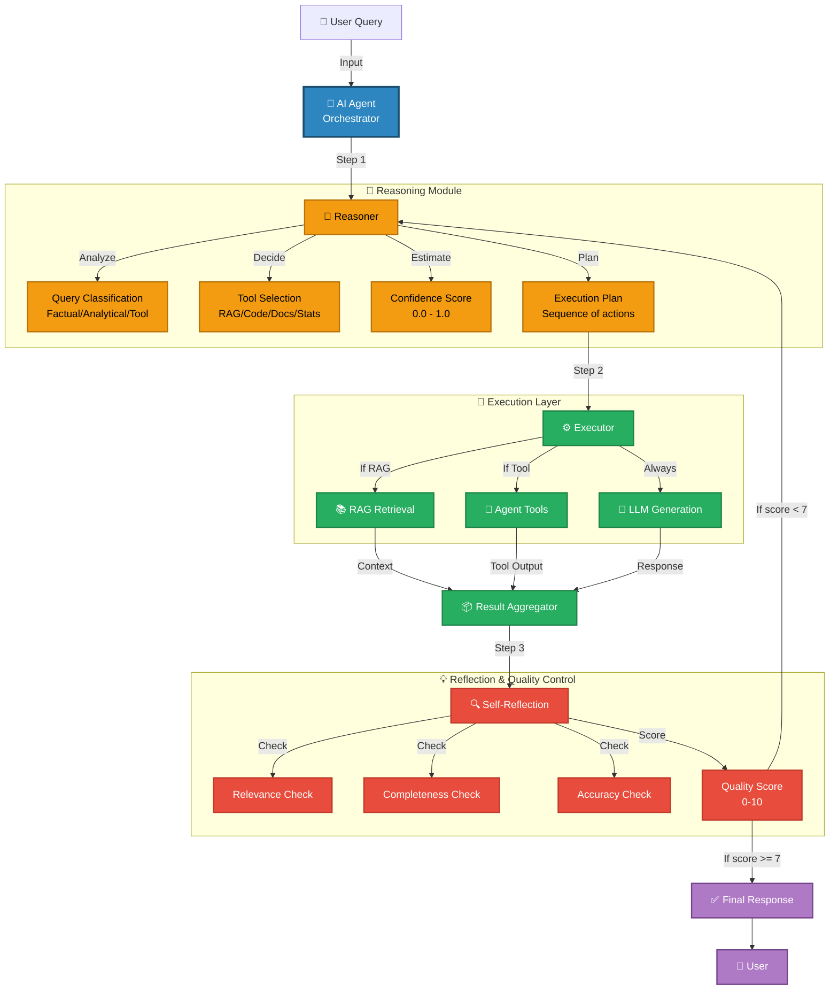
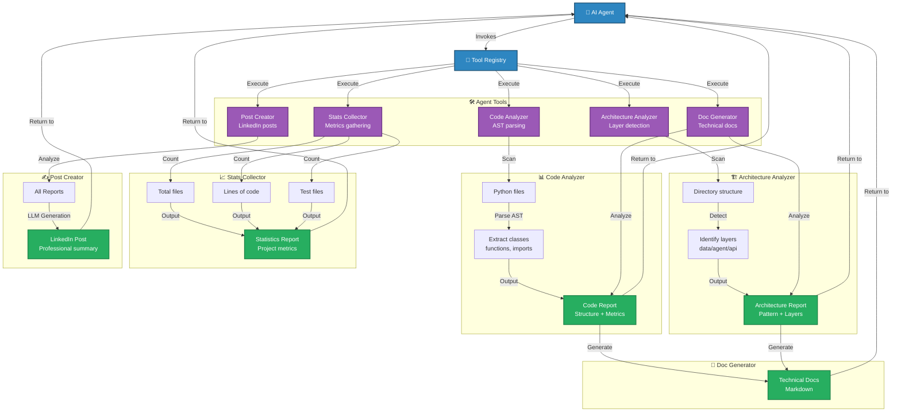
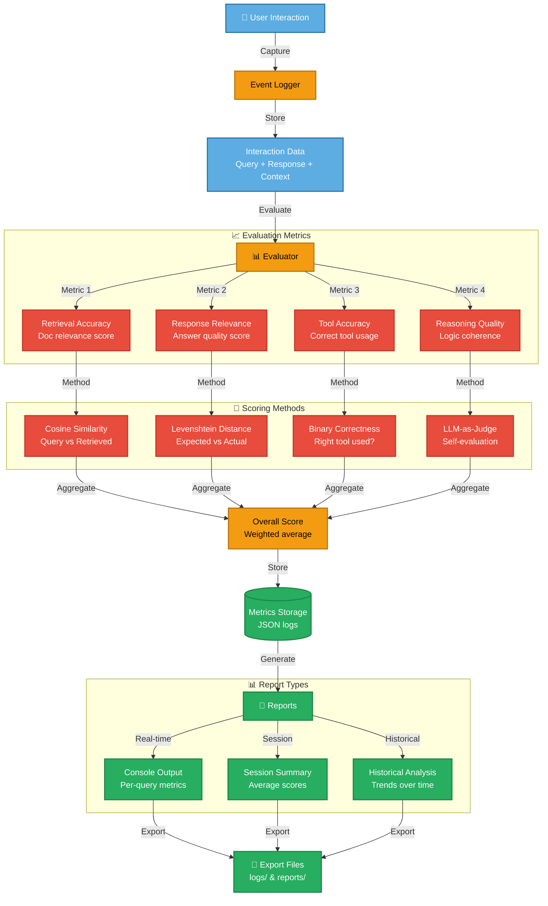
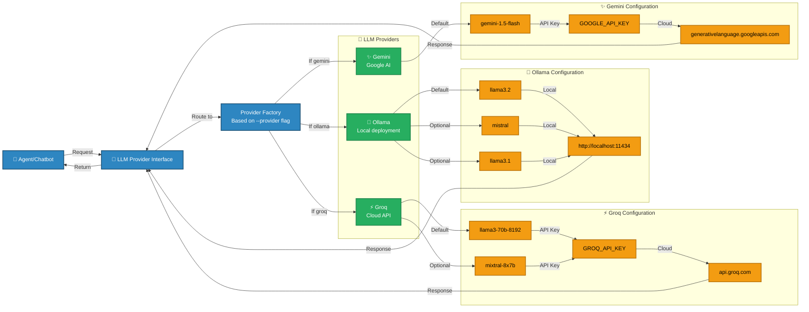
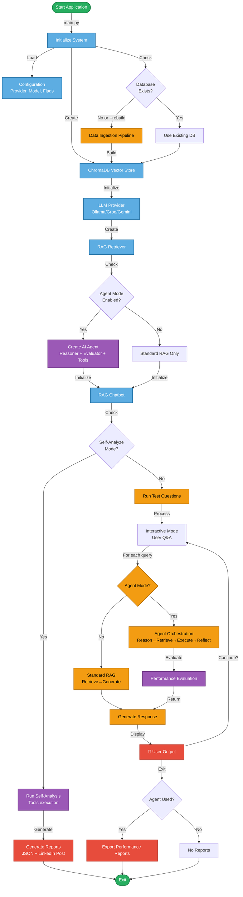

# Architecture Components - Detailed Diagrams

This document breaks down the complete architecture into individual components for presentation purposes. Each diagram can be rendered separately in Mermaid.

---

## Component 1: Data Ingestion Pipeline

**Purpose**: Transform raw data (PDFs, Audio) into searchable vector embeddings

**Key Technologies**:
- **PDF**: PyMuPDF (text extraction), pdfplumber (table extraction)
- **Audio**: OpenAI Whisper (speech-to-text)
- **Chunking**: LangChain SemanticChunker (overlap for context preservation)
- **Embeddings**: Sentence Transformers (all-MiniLM-L6-v2, 384 dimensions)
- **Storage**: ChromaDB (local SQLite-based vector database)

**Demo Points**:
1. Show input files in `data/pdfs/` and `data/audio/`
2. Run `--rebuild` flag to trigger ingestion
3. Show progress bars for each document
4. Check ChromaDB count: `vector_store.collection.count()`

---

## Component 2: RAG Inference Flow

**Purpose**: Retrieve relevant context and generate answers using LLM

**Key Features**:
- **Semantic Search**: Cosine similarity in 384-dim space
- **Top-K Retrieval**: Default k=5, configurable
- **Relevance Filtering**: Score threshold to remove low-quality matches
- **Source Citations**: Track document source + page number
- **Multi-Provider**: Same interface for Ollama, Groq, Gemini

**Demo Points**:
1. Ask test question
2. Show retrieved documents (top-3 with scores)
3. Show assembled context sent to LLM
4. Display answer with source citations
5. Compare providers (speed, quality)

---

## Component 3: Agent Orchestration & Reasoning

**Purpose**: Autonomous decision-making, tool selection, and self-reflection

**Key Capabilities**:
- **Query Classification**: Determines question type (factual, analytical, code-based)
- **Tool Selection**: Decides which tools to invoke based on query
- **Confidence Estimation**: Self-awareness of answer reliability
- **Self-Reflection**: Quality gate before response delivery
- **Iterative Refinement**: Re-tries if quality score < threshold

**Demo Points**:
1. Show agent classifying different query types
2. Display tool selection logic
3. Show confidence scores
4. Demonstrate self-reflection (quality check)
5. Show iteration when initial response is low-quality

---

## Component 4: Agent Tools System

**Purpose**: Specialized tools for code analysis, documentation, and content generation

**Tool Details**:

| Tool | Implementation | Output |
|------|----------------|--------|
| **Code Analyzer** | Python `ast` module | Classes, functions, docstrings |
| **Arch Analyzer** | Directory pattern matching | Layers, architecture type |
| **Stats Collector** | File system traversal | File count, LOC, test coverage |
| **Doc Generator** | Template-based | Technical documentation |
| **Post Creator** | LLM-powered | LinkedIn post text |

**Demo Points**:
1. Run `--self-analyze` mode
2. Show each tool executing in sequence
3. Display intermediate outputs (code stats, architecture)
4. Show final LinkedIn post generation
5. Open saved reports in `reports/`

---

## Component 5: Performance Evaluation System

**Purpose**: Measure and track system performance across multiple dimensions

**Evaluation Dimensions**:

1. **Retrieval Accuracy** (0.0 - 1.0)
   - Measures relevance of retrieved documents
   - Uses cosine similarity between query and doc embeddings
   - Higher = better context for LLM

2. **Response Relevance** (0.0 - 1.0)
   - Measures answer quality vs. question
   - Uses semantic similarity + keyword overlap
   - Higher = more relevant answer

3. **Tool Accuracy** (0.0 - 1.0)
   - Binary: Did agent use correct tool?
   - Tracks tool selection correctness
   - 1.0 = correct tool, 0.0 = wrong/missing

4. **Reasoning Quality** (0 - 10)
   - LLM-as-judge self-evaluation
   - Assesses logical coherence
   - Higher = better reasoning chain

**Demo Points**:
1. Run agent mode with evaluation enabled
2. Show real-time metrics after each question
3. Display session summary (average scores)
4. Open `reports/evaluation_TIMESTAMP.json`
5. Highlight improvements over time (if multiple sessions)

---

## Component 6: Multi-Provider LLM Layer

**Purpose**: Abstract LLM provider interface for flexibility

**Provider Comparison**:

| Feature | Ollama | Groq | Gemini |
|---------|--------|------|--------|
| **Deployment** | Local | Cloud | Cloud |
| **Speed** | Medium | Fast | Fast |
| **Privacy** | High | Medium | Medium |
| **Cost** | Free | Free (limited) | Free (limited) |
| **Setup** | `ollama serve` | API key | API key |
| **Best For** | Privacy, offline | Speed, large models | Low-latency, multimodal |

**Demo Points**:
1. Show switching providers: `--provider ollama` → `--provider groq`
2. Compare response times for same query
3. Show configuration in `.env` file
4. Demonstrate model override: `--model llama3-8b`

---

## System Integration Diagram

**Purpose**: How all components work together end-to-end

---